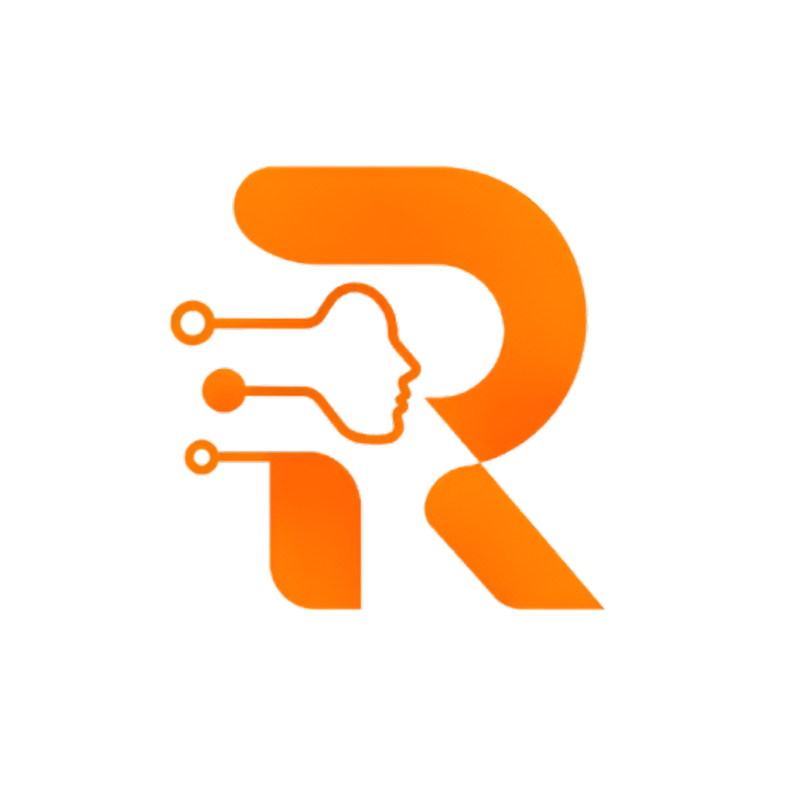
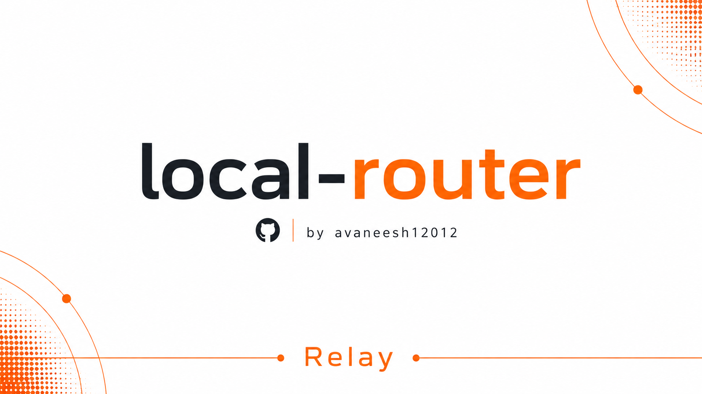
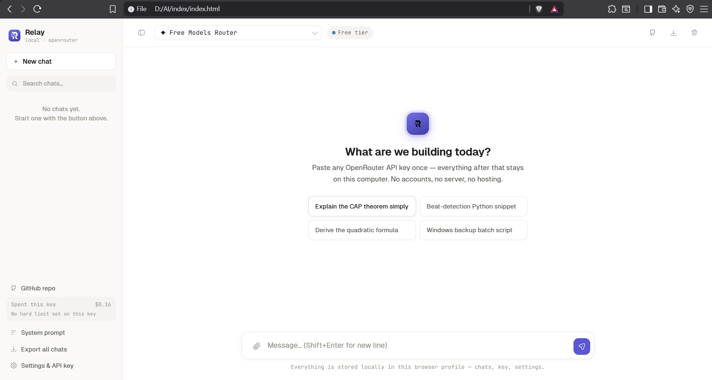
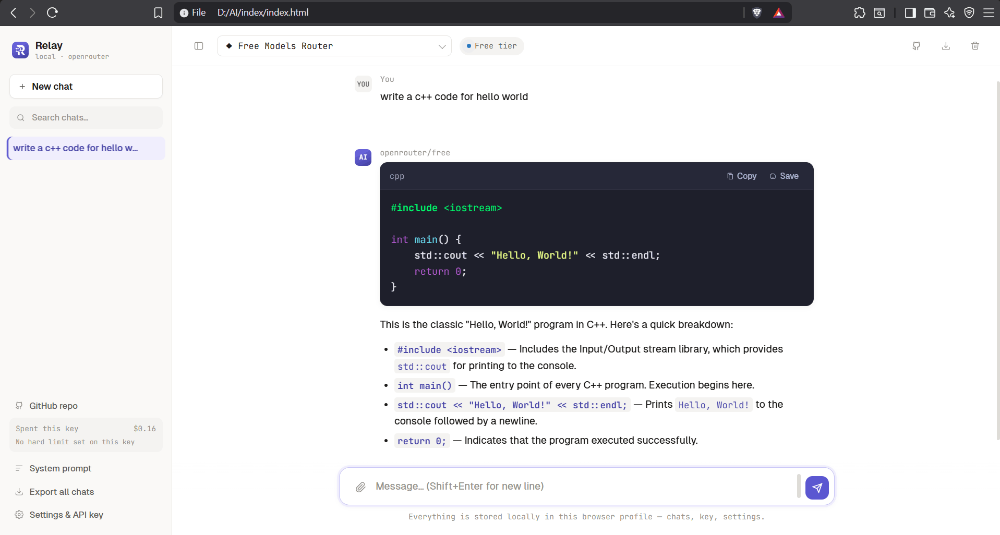
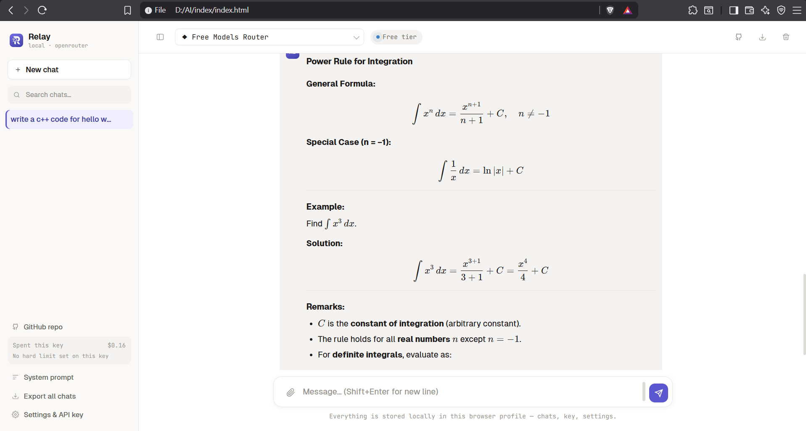
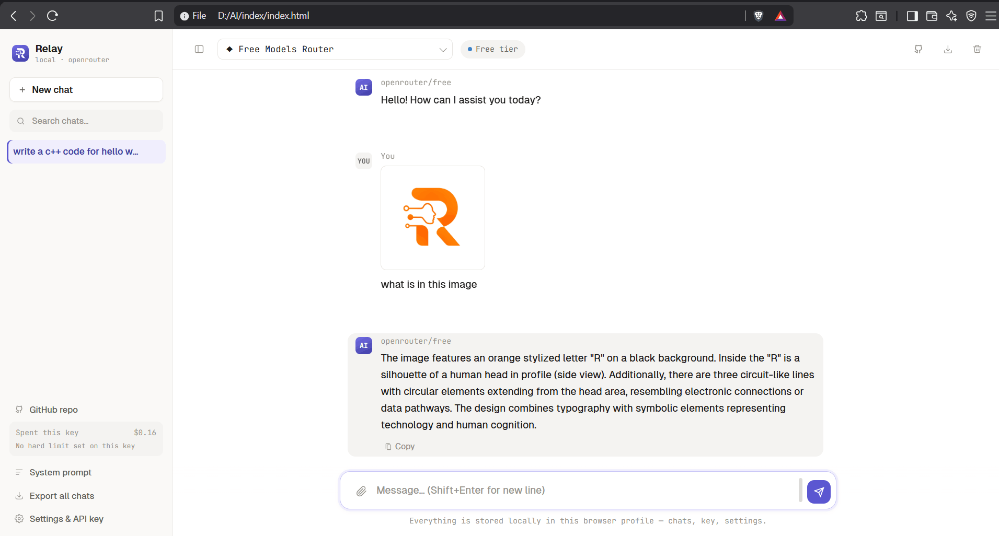
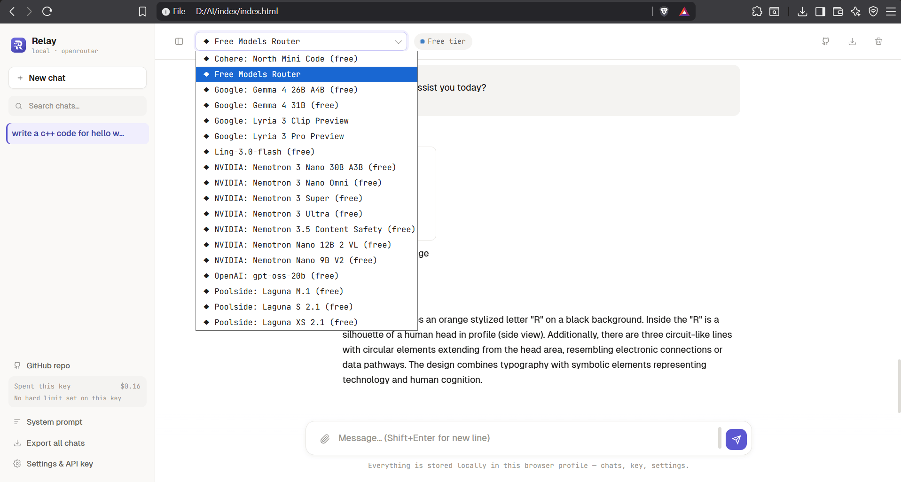

<!---
Copyright 2026 Avaneesh Shahi

Licensed under the Apache License, Version 2.0 (the "License");
you may not use this file except in compliance with the License.
You may obtain a copy of the License at

    http://apache.org

Unless required by applicable law or agreed to in writing, software
distributed under the License is distributed on an "AS IS" BASIS,
WITHOUT WARRANTIES OR CONDITIONS OF ANY KIND, either express or implied.
See the License for the specific language governing permissions and
limitations under the License.
--->
<div align="center">

  

  <br />

  

  <br /><br />

  <!-- Status badges (icon + typing text, aligned side by side) -->
  <p align="center">
    &nbsp;
    &nbsp;&nbsp;
    &nbsp;
  </p>

  <!-- Release link: add href below -->
  <p align="center">
    <!-- <a href="">Download beta 0.1</a> -->
  </p>

  <br />

  <!-- Logo -->

  

<br /><br />

  <!-- Badges Grid -->

  <p align="center">
    <picture>
      <source media="(prefers-color-scheme: dark)" srcset="https://www.shieldcn.dev/github/stars/avaneesh12012/local-router.svg?variant=ghost&size=sm&mode=dark&v=1.0">
      
    </picture>
    <picture>
      <source media="(prefers-color-scheme: dark)" srcset="https://www.shieldcn.dev/github/branches/avaneesh12012/local-router.svg?variant=ghost&size=sm&mode=dark&v=1.0">
      
    </picture>
    <picture>
      <source media="(prefers-color-scheme: dark)" srcset="https://www.shieldcn.dev/github/contributors/avaneesh12012/local-router.svg?theme=emerald&size=sm&mode=dark&variant=ghost&v=1.0">
      
    </picture>
    <picture>
      <source media="(prefers-color-scheme: dark)" srcset="https://www.shieldcn.dev/github/last-commit/avaneesh12012/local-router.svg?variant=ghost&size=sm&mode=dark&v=1.0">
      
    </picture>
    <picture>
      <source media="(prefers-color-scheme: dark)" srcset="https://www.shieldcn.dev/github/commits/avaneesh12012/local-router.svg?variant=ghost&size=sm&mode=dark&v=1.0">
      
    </picture>
    <picture>
      <source media="(prefers-color-scheme: dark)" srcset="https://www.shieldcn.dev/github/license/avaneesh12012/local-router.svg?variant=ghost&size=sm&mode=dark&v=1.0">
      
    </picture>
    
  </p>

  <br />

  <!-- Banner -->

  

</div>


##  About

**Local Router** was created so people don't have to deal with editing complex config or `.env` files. Most new users and beginners find managing configuration files frustrating and just want a simple **"paste the key and move on"** experience.

Since **OpenRouter** provides a free API key with the easiest and best setup, it was chosen as the primary provider for our initial release.


##  Quick Start


###  Option 2: Direct Run

Download or save the index.html file.
Double-click index.html to open it in any web browser (Chrome, Edge, Firefox, Brave, Safari).
Paste your OpenRouter API Key and start chatting instantly!


##  Features


-  **Zero-Configuration Setup**
  Paste your OpenRouter API key once. No .env files, build tools, or server hosting needed.

-  **Automatic Key Tier Detection**
  Auto-detects whether your API key is on the Free Tier or Paid Tier and displays it directly beside the model selector.

-  **Live API Usage & Cost Counter**
  Tracks total dollars spent and usage statistics on your key in real time right in the sidebar.

-  **LaTeX & Mathematical Formula Support**
  Renders complex mathematical formulas, equations, and mathematical proofs seamlessly using inline and block LaTeX.

-  **Code Blocks with 1-Click Copy**
  Beautifully highlighted syntax for all programming languages paired with an easy one-click copy button.

-  **Rich Text & Formatting**
  Full Markdown parsing supporting real-time bold, italics, tables, lists, blockquotes, and custom formatting.

-  **Instant Chat Search**
  Easily search through all your historical conversations using the sidebar search bar.

-  **Custom System Prompts**
  Set system instructions globally or per conversation to customize model behavior.

-  **Chat Exporter**
  Export your entire chat history with a single click.

-  **100% Private & Local**
  All conversation logs, settings, and API keys are stored exclusively inside your browser's local storage (localStorage). Nothing ever touches an external server.


##  Screenshots


<br />



<p align="center"><sub><b>Welcome Screen</b></sub></p>

** Welcome Screen** — The empty state greets you with *"What are we building today?"* along with quick-start prompt suggestions. The sidebar shows key spend (`$0.16`), no chat history until you begin, and a **Free Tier** badge next to the active **Free Models Router** so you always know which tier your key is on.

<br />



<p align="center"><sub><b>Code Blocks & Syntax Highlighting</b></sub></p>

** Code Blocks & Syntax Highlighting** — Asking for code (e.g. a C++ "Hello, World!" example) returns a dark, color-coded code panel with a language label, plus **Copy** and **Save** buttons. The explanation below uses inline code formatting and bullet points, all rendered from Markdown in real time.

<br />



<p align="center"><sub><b>LaTeX & Mathematical Formula Rendering</b></sub></p>

** LaTeX Rendering** — Mathematical responses (like the Power Rule for Integration) render as properly typeset equations, both inline and as centered display blocks, instead of raw LaTeX syntax — making proofs, formulas, and step-by-step solutions easy to read.

<br />



<p align="center"><sub><b>Image Uploads & Vision Support</b></sub></p>

** Image Uploads & Vision Support** — Attach an image directly in the message box and ask a vision-capable model to describe it. The uploaded image appears inline in the chat, and the AI's response is added below it — all handled through the paperclip attachment icon in the input bar.

<br />



<p align="center"><sub><b>Model Selector</b></sub></p>

** Model Selector** — Click the model dropdown at the top to instantly switch between every free and paid model exposed by your OpenRouter key (Cohere, Google Gemma, NVIDIA Nemotron, OpenAI gpt-oss, Poolside, and more), with the currently active model highlighted.


##  Modes of Operation


Local Router is designed to work wherever you need it:

| Mode | Status | Description |
| :--- | :---: | :--- |
|  **index.html** |  Available | A single, lightweight file running locally on your device. All chat histories are saved securely in your browser's localStorage. |
|  Website |  Coming Soon | Sign in or Sign up to access. Chat logs are stored in localStorage, while API keys can either be saved to the cloud or entered per session. |
|  Apps |  In Development | Native desktop app for Windows and mobile app for Android. |

(Note: macOS and iOS are not currently planned—all features remain accessible on those platforms through index.html or the website).


##  Git Clone


```bash
git clone https://github.com/avaneesh12012/local-router.git
```


##  Contributing


Contributions, bug reports, and feature suggestions are always welcome! Feel free to open an issue or submit a pull request on the GitHub Repository.


##  License

This project is open source and available under the Apache 2.0 License.

<div align="center">

  <p align="center">
    <picture>
      <source media="(prefers-color-scheme: dark)" srcset="https://shieldcn.dev/badge/made%20with%20love.svg?theme=rose&logoColor=red&mode=dark">
      
    </picture>
  </p>

  <br />

  <picture>
    <source media="(prefers-color-scheme: dark)" srcset="https://raw.githubusercontent.com/platane/snk/output/github-contribution-grid-snake-dark.svg">
    
  </picture>

  

</div>
